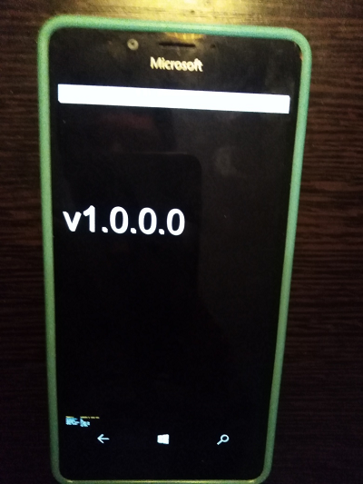

# CocosSharp.UWP
Experimental UWP implementation for popular CocosSharp gamedev "engine". 

## About
I forked this [Andy's CocosSharp-uwp-fork](https://github.com/Andy9FromSpace/CocosSharp) project.

This is draft only. UWP Library seems to be not completed. No samples... only 1 test project... so.. *as is*.

## 2 super-crazy ideas from [m][e] 
- "CocosSharp Engine"-based XBOX UWP apps
- "CocosSharp Engine"-based ARM64 UWP apps, and even ARM32... hehe (hello from  W10M))

## Screenshots

## My 2 cents
- /Src/CocosSharp.UWP.sln  - CocosSharp.UWP "framework" solution;
- /Src/Tests/CocosSharp.Tests.WindowsUWP.sln - Demo "test app" :)
- Min. win os build switched to 15063; 
- Target ARM tested a little, and Win x64 too.

## Current status / Plan for future experiments
Experimenting with a specific UWP "target" for CocosSharp, and have some thoughts: 

UWP can support .NET Standard from 1.4 to 2.0. Is it worth restricting core components to 1.4 for some time just for that? 

CocosSharp.UWP + Xamarin Forms = ? 

What if I use/RnD SkiaSharp instead of CocosSharp... idk ^ ^

## TODO
Full Xamarin Forms support (Android, iOS, and UWP "family")

## References
- [Andy9FromSpace's GitHub](https://github.com/Andy9FromSpace)
- [Andy's CocosSharp fork](https://github.com/Andy9FromSpace/CocosSharp)
- [mono/CocosSharp, Archive](https://github.com/mono/CocosSharp) 
- [Social.Msdn.Microsoft.Com Discussion](https://social.msdn.microsoft.com/Forums/en-US/cfc972eb-8a7c-4caf-aa9e-401187a58cef/cocossharp-for-uwp?forum=xamarinlibraries)

## ..
AS IS. No support. RnD only. 

## .
[m][e] 2022, October